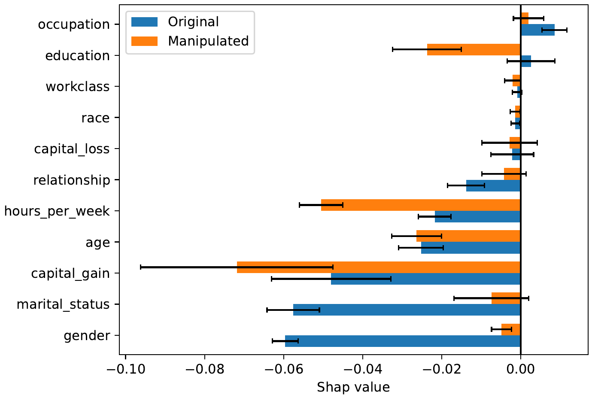

# Fool SHAP with Stealthily Biased Sampling

## Description

This repository implements the code of the following paper.

* G. Laberge, U. Aïvodji, S. Hara, [Fool SHAP with Stealthily Biased Sampling](https://arxiv.org/abs/1901.08291). ICLR 2023,
International Conference on Learning Representations.

The main idea is to leverage the stealthily biased sampling technique introduced in

* K. Fukuchi, S. Hara, T. Maehara, [Faking Fairness via Stealthily Biased Sampling](https://arxiv.org/abs/1901.08291). AAAI'20 Special Track on Artificial Intelligence for Social Impact (AISI).

to manipulate `SHAP` feature attributions and hide the dependence
of the model on sensitive attributes. The proposed technique is
called **Fool SHAP** and has been shown to be effective in
modifying post-hoc feature attributions while remaining
undetected by an external audit with limited access to the model
and data. Here is an example of the attack conducted on the
Adult-Income dataset to reduce the dependence on `gender`.



## Requirements

- g++ (-std=c++11)
- [lemon](https://lemon.cs.elte.hu/trac/lemon/)

# Installation

### 1. Install LEMON

To install the ``LEMON`` C++ Library, do the following

```console
sudo apt install g++ make cmake 
wget http://lemon.cs.elte.hu/pub/sources/lemon-1.3.1.tar.gz
tar xvzf lemon-1.3.1.tar.gz
cd lemon-1.3.1
mkdir build
cd build
cmake ..
make
sudo make install
```

### 2. MakeFile

Build all C++ code within the repository
using the provided MakeFile.

```console
make
```

This MakeFile has two targets.

1. **tree_shap** will compile the custom implementation of TreeSHAP `src/tree_shap/treeshap.cpp`.
2. **fool_shap** will compile the solver for the
        Minimum Cost Flow `src/fool_shap/mcf.cpp`.

### 3. Install SHAP Fork

To attack the `ExactExplainer`, we use monkey-patching via a fork 
of the original `SHAP` repository

```console
git clone https://github.com/gablabc/shap.git
cd shap
git checkout biased_sampling
cd ..
```

If you do not install `SHAP` directly in this repository,
you must tell the Python interpreter where to look for it.
In Linux, this is done via the command

```console
export PYTHONPATH=<path to shap>:${PYTHONPATH}
```

which can be added to your `.bashrc` file.

# Tutorials

The scripts `0_example_adult.py` and `0_example_employment.py` show basic examples of the attack on adult-income
and a toy employment dataset. These scripts are meant as basic tutorials of **Fool SHAP**. Start by running and understanding these scripts.

# Experiments

### Data Preprocessing

Preprocess the data by running

```console
cd datasets
./main.sh
cd ..
```

### Model Training

Train all models by running

```console
./train_all.sh
```

This script can be made more efficient if its for-loops are parallelized between multiple machines. The models trained on
`<dataset>` will be stored in the folder `models/<dataset>` and all performances will be available
in `models/performance.csv`.

### Conduct the attack

The **Fool SHAP** attack is conducted in three steps. First of, the malicious company must extract $\hat{\Phi}$ coefficients. This is done via the Python script

```console
python3 2_1_compute_Phis.py --dataset=adult_income --model=xgb --rseed=0 --background_size=<custom> --background_seed=<custom>
```

where the parameter ``background_size`` controls how many points are used when solving the MCF to compute non-uniform weights of
the background distribution. Setting it to `-1` means use all the background points. This script can be run in parallel different machines for different values of ``background_seed``.

The second step of the attack is to compute the weights by solving a MCF for different values of regularization parameter $\lambda=\lambda_\text{min},\ldots,\lambda_\text{max}$

```console
python3 2_2_compute_weights.py --dataset=adult_income --model=xgb --rseed=0 --background_size=<custom> --background_seed=<custom> --min_log=-1 --max_log=2
```

The resulting weights for different values of ``background_seed`` will be averaged to provide the final weights. After solving the MCF, we must run the brute-force method which will act as a reference attack to which Fool SHAP can be compared.

```console
python3 2_3_brute_force.py --dataset=adult_income --model=xgb --rseed=0 --background_size=<custom> --background_seed=<custom> 
```

The final step is to sample the misleading subsets $S_0',S_1'$ and provide them to the audit.

```console
python3 2_4_final_attack.py --dataset=adult_income --model=xgb --rseed=0 --background_size=<custom> --save
```

The reductions in amplitude of $|\hat{\Phi}_s(f, S_0', S_1')|$ for
brute-force and Fool SHAP will be stored in a file
`attacks/results.csv`
